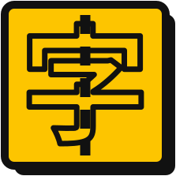

<p align="center"></p>

<p align="center">
  <a href="README.md">English</a> |
  <a href="README.zh-Hans.md">简体中文</a> |
  <a href="README.zh-Hant.md">繁體中文</a> |
  <a href="README.ja.md">日本語</a> |
  <a href="README.ko.md">한국어</a>
</p>

# CJKonospace

CJK × 等寬字型混排工作台：載入兩個字型（一個負責 CJK、一個負責等寬），在瀏覽器中即時預覽混排效果，並微調字元寬度與字形寬度，直到 CJK : mono 達到視覺平衡的 1 : 2 比例（Maple Mono 風格）。

線上應用：<https://inchei.github.io/CJKonospace/>

## 快速開始

```bash
pnpm install
pnpm dev      # 開發伺服器
pnpm build    # 生產建置（dist/）
```

## 運作方式

- **解析與預覽** — [opentype.js](https://opentype.js.org/) 解析兩個字型，Canvas 渲染器負責排版混排文字行；[harfbuzzjs](https://github.com/harfbuzz/harfbuzzjs)（WASM）執行真正的 GSUB shaping，讓等寬連字能在預覽中正確呈現。
- **WOFF2 讀寫** — WOFF2 輸入會先解壓，輸出則以 [woff2-encoder](https://github.com/itskyedo/woff2-encoder)（WASM）壓縮。
- **字型生成** — 同一份 `wasm/merge_font.py` 在瀏覽器中透過 [pyodide](https://pyodide.org/)（WASM）執行，[fontTools](https://fonttools.readthedocs.io/) 由 CDN 載入，因此不需任何伺服器往返。

三個 WASM 模組皆為延遲載入（首次使用時才下載）：harfbuzzjs（約 0.4 MB）用於 shaping、woff2-encoder（約 0.27 MB）用於 WOFF2 輸入、pyodide + fontTools（約 10 MB）用於字型生成。執行階段的 Python 不依賴 WASM 路徑 —— 詳見下方命令列章節。

## 命令列

```bash
uv run wasm/merge_font.py mono.ttf cjk.ttf out.ttf params.json
```

`mono.ttf` 是基礎字型（保留其 glyph ID、GSUB/GPOS/GDEF 與拉丁字元覆蓋），`cjk.ttf` 提供要附加的字形。`params.json`：

```json
{
  "fs": 48,
  "lock2to1": true,
  "familyName": "MyMono",
  "styleName": "Regular",
  "lineHeight": 1.0,
  "format": "ttf",
  "variations": { "mono": {}, "cjk": {} },
  "mono": { "advMul": 1, "gsx": 1, "gsy": 1, "baseline": 0, "ttcIndex": 0 },
  "cjk": {
    "advMul": 1,
    "gsx": 1,
    "gsy": 1,
    "baseline": 0,
    "ttcIndex": 0,
    "subset": { "unicodes": [19968, 19969] }
  }
}
```

| 鍵                         | 說明                                                                                 |
| -------------------------- | ------------------------------------------------------------------------------------ |
| `fs`                       | 參考字級（px）；僅用於將 `baseline` 位移由 px 換算為字型單位                         |
| `lock2to1`                 | 將 CJK 前進寬度鎖定為 2 × mono 前進寬度（本工具的核心目的）                          |
| `lineHeight`               | 重新計算的 ascent/descent 的倍率（預設 `1.0`；間隙一律為 `0`）                       |
| `format`                   | 輸出封裝格式：`ttf`（預設）或 `woff2`                                                |
| `mono` / `cjk.advMul`      | 前進寬度倍率                                                                         |
| `mono` / `cjk.gsx`, `gsy`  | 輪廓縮放（字形寬／高），不影響前進寬度                                               |
| `mono` / `cjk.baseline`    | 基線位移，單位 px（見 `fs`）                                                         |
| `mono` / `cjk.ttcIndex`    | 輸入為 `.ttc` 集合時指定的字面索引（預設 `0`）                                       |
| `variations.mono` / `.cjk` | 可變字型的實例位置（軸標籤 → 值），例如 `{ "wght": 700 }`                            |
| `mergeWght`                | 將共用的 `wght` 軸合併為可變輸出，而非固定（見下方說明）                             |
| `weightMap`                | `[[mono, cjk], ...]` wght 錨點（使用者數值），配對兩個字型；預設對齊 min/default/max |
| `axisRange`                | `{"min": ..., "max": ...}` 縮小輸出 wght 範圍（預設：mono 的完整範圍）               |
| `cjk.subset`               | 僅保留 CJK 輸入中的這些碼位，例如 `{ "unicodes": [19968] }`（省略 = 全部）           |

備註：

- 輸入可為 TTF、OTF 或 WOFF2（WOFF2 會先解壓；命令列會為此宣告 `brotli` 依賴）。
- 支援 TTC 集合：以 `ttcIndex` 選擇字面（預設 `0`）。
- 可變字型輸入會透過 `variations.mono` / `variations.cjk`（fontTools `varLib.instancer`）固定為靜態實例；空的位置會將所有軸固定於預設值。
- 使用 `mergeWght` 時，共用的 `wght` 軸會合併為可變輸出而非固定。兩個輸入都必須是具備 `wght` 軸的可變 `glyf`/`gvar` 字型（否則會回退為靜態並發出警告）；輸出涵蓋 mono 的範圍，保留 mono 基礎字型的 avar 字重曲線、其具名實例與 `rvrn` 替換，並透過 `weightMap` 錨點配對兩個字型的主控。
- CJK 輸入可用 `cjk.subset.unicodes` 子集化（fontTools `subset`，於實例化／合併之前套用）。
- 輸出輪廓一律為 TrueType（`glyf`）；設定 `format: "woff2"` 可取得同一字型的 WOFF2 封裝。CFF/OTF mono 基礎字型會被轉換（cu2qu；CFF hinting 會被捨棄）。
- 本工具不會更動 hinting，因此縮放後的 CJK 字形會保留其原始指令。
- 垂直度量（`hhea` ascent/descent、`OS/2` typo + win 度量）會依兩個字型重新計算以涵蓋所有字形，避免過高的 CJK 字形被裁切。`hhea.lineGap` 與 `OS/2.sTypoLineGap` 會強制設為 `0`，因為終端對正間隙的處理並不一致。
- 只有在 mono 基礎字型的可列印 ASCII 字形確實共用同一前進寬度時，結果才會被標記為等寬（`post.isFixedPitch = 1`、`OS/2.panose.bProportion = 9`；`OS/2.xAvgCharWidth` = 半寬；缺少時會加入 `gasp` 表）（CJK 依設計為全寬 2 倍，不在此檢查範圍內；沒有 ASCII 字形的基礎字型也算作非等寬）。比例字型會保留其自身的旗標。
- `styleName` 可自由輸入，用於設定輸出子家族（name ID 2/17/22）與樣式中介資料（`OS/2.usWeightClass`、`OS/2.usWidthClass`、`fsSelection`、`head.macStyle`），採用 [OpenType name 範例](https://learn.microsoft.com/en-us/typography/opentype/spec/namesmp)的關鍵字對應。可留空以沿用 mono 基礎字型的子家族並保持其樣式中介資料不變。

## 授權

GPL-3.0-only
